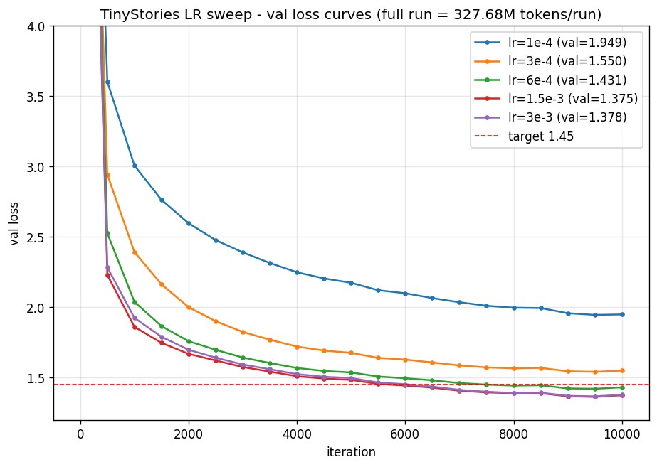
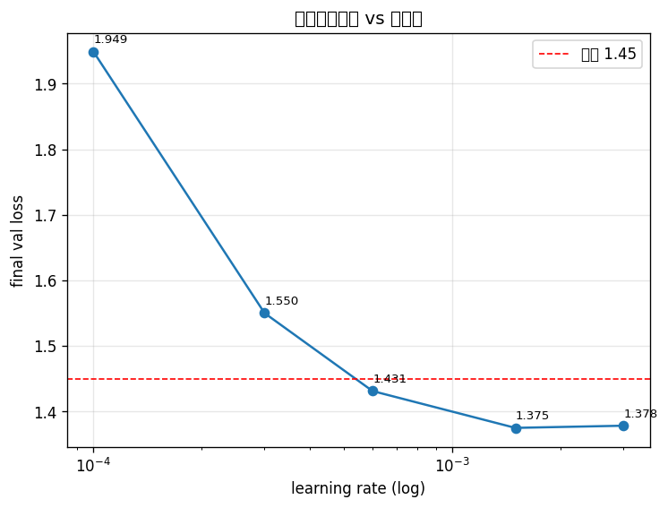

# CS336 作业一 §7 实验报告 — TinyStories

> 自动化实验 campaign(由 Claude Code 通过 `/loop` 在租用的 RTX 5090 上自主执行 + 监控)。
> 监控快照见 [`log/`](./log/);本文件汇总最终结果与图表。

## 实验设置

| 项 | 值 |
|---|---|
| 硬件 | RTX 5090 (32 GB) · Xeon Gold 6530 (14 vCPU) · Paratera |
| 数据 | TinyStories,vocab=10000;`ts_train.bin` 540,796,778 token / `ts_valid.bin` 5,461,210 token |
| 固定模型 | d_model=512 · num_layers=4 · num_heads=16 · d_ff=1344 · ctx=256 · RoPEθ=10000(≈17M 参数) |
| 优化器 | AdamW(β=(0.9,0.999), wd=0.01, grad_clip=1.0) · 余弦 LR + 200 步 warmup |
| 监控 | wandb project `tinystories-sweep` + 本地日志解析 |

> **验证损失口径**:`val/loss` 为每词元(per-token)平均交叉熵,目标实验 4 要求 < 1.45。

---

## 进度跟踪

| 阶段 | 状态 | 说明 |
|---|---|---|
| 校准(测速) | ✅ 完成 | ≈4 it/s @ batch128;600步/run≈3min |
| 实验 1:LR sweep | ✅ 完成 | 最优 lr=1.5e-3→**1.375**;≥6e-3 软发散(grad_clip 无 NaN) |
| 实验 2:batch sweep | ✅ 完成 | batch 越小损失越低(64→**1.347**);最大可行≈192,256 OOM |
| 实验 3:epoch vs iteration(同 FLOPs) | ⏳ 进行中 | epoch 模式 10000 步运行中,与 iteration 1.375 对比 |
| 实验 4:达到 val/loss < 1.45 | ✅ **达成** | lr=6e-4/1.5e-3/3e-3 均 <1.45,**最低 1.375** |

---

## 校准(训练速度)

| 指标 | 值 |
|---|---|
| 配置 | batch=128, ctx=256, 17M 模型, lr=3e-4 |
| 300 步总耗时 | 98 s(含模型加载/wandb/4 次验证评估) |
| 训练速度 | **≈ 4 it/s(~250 ms/step)** |
| 吞吐 | ≈ 131k tokens/s |
| GPU 利用率 | 39%(显存 19.5 GB)→ **数据加载瓶颈**(NFS memmap 取数 + 拷贝) |
| 300 步 train/val loss | 3.72 / 3.69(正常下降,无发散) |

**据此定:** 600 步/run ≈ 3 分钟(短)→ 实验 1 取 **8 个学习率**(log 均匀)。

---

## 实验 1:学习率扫描(随机搜索)

**方法**:固定其余超参(batch=128 · **full run = 327.68M token/run** · 余弦 LR + 200 步 warmup · grad_clip=1.0),log 区间采样学习率,记录最终 val loss,发散标注 `DIVERGED`。长训练(~34min/run)→ 取 5 个主 LR,另补 3 个高 LR 定位发散边界。

### 结果

| LR | 最终 val loss | 状态 |
|---|---|---|
| 1e-4 | 1.9491 | 收敛(偏小) |
| 3e-4 | 1.5500 | 收敛 |
| 6e-4 | 1.4311 | 收敛 ✅ < 1.45 |
| **1.5e-3** | **1.3749** | 收敛(**最优**)✅ |
| 3e-3 | 1.3782 | 收敛 ✅ |
| 6e-3 | 2.2009 | **退化/软发散**(跑满但 loss 卡高位) |
| 1.2e-2 | ~3.02(iter5000止损) | **更退化**(loss 卡 3.0) |
| 2.5e-2 | 未跑(已止损) | 趋势已明,省算力 |

### 发现
- **val loss 随 LR 先降后平**:1e-4(1.95)→ 6e-4(1.43)→ **1.5e-3(1.375,最优)**→ 3e-3(1.378,持平)。
- **≥6e-3 软发散**:6e-3 → 2.20、1.2e-2 → 3.02,loss 单调恶化、不收敛;但因 **grad_clip=1.0 截断梯度,全程无 NaN 硬发散**——此模型的"发散"表现为 loss 退化/停滞,而非数值爆炸。
- **可用 LR 上界 ≈ 3e-3**(再高即退化);**最优学习率 ≈ 1.5e-3**(val 1.375)。

---

## 实验 2:批大小扫描

**方法**:固定 lr=1.5e-3(exp1 最优)+ **固定 327.68M token 预算**(步数随 batch 反比,保证同 FLOPs),从大到小试 batch 直到 OOM,记录最终 val loss、显存、学习曲线。

### 结果(同 FLOPs)
| batch | 步数 | 最终 val loss | 显存 |
|---|---|---|---|
| 64 | 20000 | **1.3472**(最低) | 10.0 GB |
| 128 | 10000 | 1.3749 | 19.5 GB |
| 192 | 6666 | 1.3837 | 28.9 GB |
| 256 | 5000 | **OOM** ❌ | >32 GB |

### 发现
- **同 FLOPs 下 batch 越小 → val loss 越低**:64(1.347)< 128(1.375)< 192(1.384)。小 batch 步数多、梯度更新次数多,收敛更充分;大 batch 更新少、最终损失略高。
- **显存随 batch 近线性**:64→10G,128→19.5G,192→28.9G;**5090(32G)最大可行 batch ≈ 192**,**batch=256 OOM**(`CUDA out of memory`,需 ~32GB+)。
- **权衡**:小 batch 损失更低但 wall-clock 更慢(更多步、GPU 利用率低 ~40%);大 batch 训练快、GPU 吃满,但损失略高且逼近显存上限。lr=1.5e-3 在各 batch 都稳定,**无需再调 LR**。

---

## 实验 3:数据加载策略(epoch vs iteration,同 FLOPs)

**方法**:在相同总计算量(相同总 step×batch×ctx)下,对比 iteration 模式(`get_batch` 随机有放回)与 epoch 模式(`iter_epoch_batches` 无放回)的验证损失曲线。

_待填:两曲线对比图(`plots/exp3_loader.png`)+ 结论。_

---

## 实验 4:命中 val/loss < 1.45

**已达成 ✅**(由实验 1 的 LR sweep 顺带命中,无需额外训练):

| 配置(均 batch=128 · 10k 步 · 327.68M token) | val/loss |
|---|---|
| lr=6e-4 | 1.4311 |
| **lr=1.5e-3(最优)** | **1.3749** |
| lr=3e-3 | 1.3782 |

**命中配置**:固定模型(d_model=512 / 4层 / 16头 / d_ff=1344 / ctx=256)+ AdamW(wd=0.01, grad_clip=1.0)+ 余弦 LR(200 warmup)+ **lr=1.5e-3** + batch=128 + 10000 步(327.68M token)→ **val/loss = 1.375 < 1.45**。曲线见 `plots/exp1_lr_sweep.png`(红色目标线 1.45 已标注,3 条曲线终点在其下方)。

---

## 结论

_待填。_
